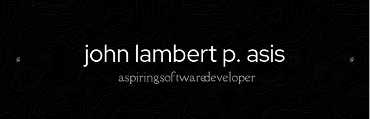

<h1 align="center">Hi , I'm John Lambert P. Asis</h1>
<h3 align="center">Aspiring software developer based in Philippines</h3>

  

- 🔭 I’m currently working on [kapejuancafe](htttps://www.kapejuancafe.shop/)

- 🌱 I’m currently learning **web development**

- 👯 I’m doing upskill on [library system](https://bcc-opac-library.site/)

- 👨‍💻 All of my projects are available at (https://www.johnlambert-asis.com/)

- 💬 Ask me about **React, and Angular**

- 📫 How to reach me **asisjohnlambert5@gmail.com**

- 📄 Know about my experiences [[https://lime-morganne-83.tiiny.site/](lime-morganne-83.tiiny.site)](https://lime-morganne-83.tiiny.site/)

- ⚡ Fun fact **Shy type mwehehehee....**

   
<picture>
  <source
    srcset="https://github-readme-stats.vercel.app/api?username=johnLamberts&show_icons=true&theme=dark"
    media="(prefers-color-scheme: dark)"
  />
  <source
    srcset="https://github-readme-stats.vercel.app/api?username=johnLamberts&show_icons=true"
    media="(prefers-color-scheme: light), (prefers-color-scheme: no-preference)"
  />
  
</picture>

 

<h3 align="left">Some of my works:</h3>

 

<h3 align="left">Connect with me:</h3>

 
 
 

<h3 align="left">Languages and Tools:</h3>
  
   
  
   
  

